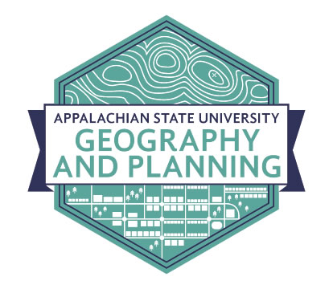

Johnathan Sugg :computer: :punch: :moneybag: :moneybag: :moneybag:
=

#### Assistant Professor of Geography   [Department of Geography and Planning](http://geo.appstate.edu)   Appalachian State University   Boone, North Carolina

Expertise
--
climate variability and change. climate change communication. user-centered design for interactive webmaps. cartography.

Education
--
Ph.D. in Geography, University of North Carolina

Professional Experience
--
Assistant Professor, Appalachian State University *2017-present*
Graduate Research Associate, Southeastern Regional Climate Center *2013-2017*
